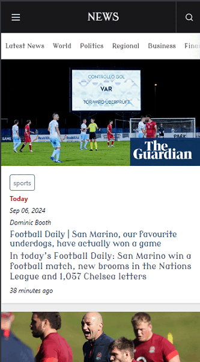
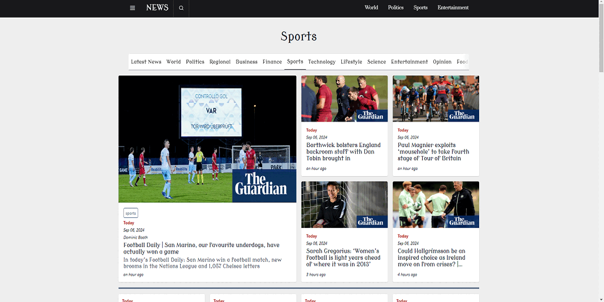

<h1 align="center">
  NEWS
</h1>

  <a href="#-tecnologias">Tecnologias</a>&nbsp;&nbsp;&nbsp;|&nbsp;&nbsp;&nbsp;
  <a href="#-projeto">Projeto</a>&nbsp;&nbsp;&nbsp;|&nbsp;&nbsp;&nbsp;
  <a href="#-como-executar">Como executar</a>&nbsp;&nbsp;&nbsp;|&nbsp;&nbsp;&nbsp;
  <a href="#-licença">Licença</a>

  
  

 

 

  
<a href="" target="_blank">Link Para Visualização Do Projeto</a>
   

 

 

 

## ✨ Tecnologias

* <a href="https://react.dev/" target="_blank">React</a>
* <a href="https://www.typescriptlang.org/" target="_blank">Typescript</a>
* <a href="https://ui.shadcn.com/" target="_blank">Shadcn</a>
* <a href="https://lucide.dev/" target="_blank">Lucide</a>
* <a href="https://currentsapi.services/en/docs/" target="_blank">CurrentsAPI</a>

## 💻 Projeto
O NEWS é uma aplicação web que oferece aos usuários a capacidade de explorar notícias em tempo real, utilizando a CurrentsAPI como fonte de dados. O projeto organiza as notícias em diversas categorias, permitindo aos usuários navegar facilmente por temas de interesse. Além disso conta com um motor de busca. Seja para acompanhar as últimas notícias ou realizar pesquisas específicas.

## 🚀 Como executar

- Clone o repositório
- Instale as dependências `npm install`
- Inicie o servidor com `npm run dev`
- Use sua API Key - <a href="https://currentsapi.services/en/docs/" target="_blank">currentsapi.com/docs</a>

## 📄 Licença

Esse projeto está sob a licença MIT. Veja o arquivo <a href="https://docs.github.com/pt/repositories/managing-your-repositorys-settings-and-features/customizing-your-repository/licensing-a-repository" target="_blank">`LICENSE`</a> para mais detalhes.